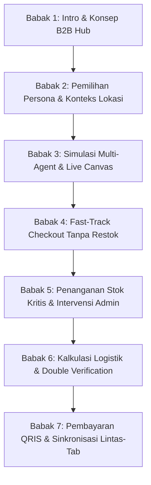

# Rencana & Naskah Demo Video: QHome-MAS (B2B Consultation & Procurement Hub)

Dokumen ini berisi panduan lengkap, skenario demo, storyboard, dan naskah narasi (Voiceover) untuk merekam video demo sistem **QHome-MAS**. Alur ini disusun berdasarkan kode program aktual yang terimplementasi pada sistem frontend dan backend.

---

## 🎬 Ringkasan Informasi Video
* **Durasi Target**: 5 - 7 Menit
* **Format**: Screencast kualitas tinggi (1080p/60fps) disertai Voiceover (VO) bahasa Indonesia.
* **Tujuan**: Mendemonstrasikan kolaborasi Multi-Agent System (MAS) dalam memproses kebutuhan konstruksi B2B secara natural hingga checkout, restok logistik terdistribusi, dan sinkronisasi lintas-tab instan.

---

## 🎞️ Peta Storyboard & Pembagian Babak

---

## 📝 Naskah Detil & Panduan Pengambilan Gambar

### Babak 1: Pendahuluan & Visual Landing Page (Durasi: 0:00 - 0:45)
* **Visual di Layar**: 
  * Tampilkan halaman utama (Landing Page) QHomeMart. Scroll secara perlahan ke bawah menampilkan *Features Section* dan *Catalog Preview* dengan transisi hover yang halus.
  * Arahkan kursor ke tombol **"Mulai Konsultasi"** di bagian atas Hero Section.
* **Aksi Kursor**: Arahkan kursor dengan santai, soroti keselarasan desain premium dan typography modern (Inter/Outfit).
* **Naskah Voiceover**:
  > *"Selamat datang di QHome-MAS, B2B Consultation & Procurement Hub masa kini. Di sini, kami menggabungkan kekuatan Multi-Agent AI untuk mendefinisikan ulang cara kontraktor, arsitek, dan retail memesan bahan bangunan secara grosir. Mari kita lihat bagaimana sistem ini bekerja."*

---

### Babak 2: Pemilihan Persona & Pengondisian Skenario (Durasi: 0:45 - 1:30)
* **Visual di Layar**:
  * Klik tombol **"Mulai Konsultasi"**. Tampilkan pop-up **Simulation Modal** dengan efek *glassmorphism* di latar belakang.
  * Sorot pilihan tiga persona: **Ibu Amalia (Architect, Sleman - 8 Km)**, **Bapak Joko (Contractor, Bantul - 15 Km)**, dan **Ibu Santi (Retailer, Kulon Progo - 35 Km)**.
  * Klik pada **Ibu Amalia** untuk masuk ke Chat Workspace.
* **Aksi Kursor**: Arahkan kursor ke detail jarak fisik dan kota masing-masing persona sebelum mengeklik Ibu Amalia.
* **Naskah Voiceover**:
  > *"Untuk memulai, sistem menyediakan beberapa persona simulasi profesional B2B. Setiap persona memiliki karakteristik proyek serta lokasi proyek fisik yang berbeda dari Kantor Pusat QHome. Perbedaan lokasi ini nantinya akan memengaruhi perhitungan kargo secara otomatis. Kali ini, kita akan masuk sebagai Ibu Amalia, seorang arsitek senior dari Sleman."*

---

### Babak 3: Konsultasi Natural & Pemantauan Agen Secara Real-Time (Durasi: 1:30 - 3:00)
* **Visual di Layar**:
  * Tunjukkan halaman obrolan (Chat Workspace) Ibu Amalia yang minimalis dan premium.
  * Klik salah satu preset prompt, misalnya **"Granit Carrara Ruang Keluarga"**, lalu tekan tombol kirim.
  * Saat sistem memproses, soroti komponen **"LoadingQuote"** yang menampilkan fakta bahan bangunan secara bergantian di bawah gelembung chat.
  * Klik ikon **User Cog (Aktivitas Staf Kantor)** di kanan atas untuk membuka panel **Live Office Canvas**. Tunjukkan indikator agen (Chief Supervisor, Tile Agent, Market Analyst, Inventory Administrator) menyala hijau secara bergantian (*waterfall execution*).
  * Setelah hasil chat muncul, klik dropdown **"Proses Berpikir Agen"** (Thinking Block) untuk menunjukkan log Chain-of-Thought (CoT).
* **Aksi Kursor**: Klik dan buka panel samping kanan, serta klik tombol expand log berpikir agen.
* **Naskah Voiceover**:
  > *"Sekarang kita berada di Chat Workspace. Kita bisa mengetik brief proyek dengan bahasa alami atau menggunakan preset. Begitu brief dikirim, Chief Supervisor langsung membagi tugas ke agen spesialis. Di panel kanan—Live Office Canvas—kita dapat melihat aliran kerja kolaboratif staf digital secara real-time. Melalui fitur 'Proses Berpikir Agen', kita bahkan dapat mengaudit penalaran logis Chain-of-Thought dari kecerdasan buatan secara transparan."*

---

### Babak 4: Pengelolaan Keranjang di Order Portal & Fast-Track Checkout (Durasi: 3:00 - 4:15)
* **Visual di Layar**:
  * Tunjukkan ikon keranjang belanja (Shopping Bag) di header yang memiliki indikator jumlah item. Klik ikon tersebut untuk beralih ke halaman **Order Portal** (`/order`).
  * Tunjukkan tampilan **Daftar Material** yang berisi produk utama (Granit Carrara White Polished) bercentang hijau, dan bahan pembantu yang berlabel `(Menunggu Konfirmasi)` dengan harga Rp 0.
  * Hilangkan centang (uncheck) pada item pendukung `(Menunggu Konfirmasi)`. Tunjukkan banner di atas berubah dari **"Draft Proposal"** (Amber) menjadi **"Keranjang Belanja Aktif (Telah Disetujui)"** (Hijau) dan tombol **"Lanjut ke Logistik"** menjadi aktif.
* **Aksi Kursor**: Lakukan deselect pada checkbox item pembantu, kemudian gerakkan kursor di atas banner status yang berubah warna secara halus.
* **Naskah Voiceover**:
  > *"Seluruh material yang direkomendasikan agen otomatis terintegrasi ke dalam Order Portal. Untuk alur checkout cepat tanpa restok, kita dapat meninjau keranjang dan menonaktifkan item pelengkap yang bertanda 'Menunggu Konfirmasi'. Seketika, proposal berubah status menjadi 'Telah Disetujui' dan tombol logistik langsung terbuka."*

---

### Babak 5: Skenario Stok Terbatas & Intervensi Admin Portal (Durasi: 4:15 - 5:30)
* **Visual di Layar**:
  * Kembali ke Chat Workspace (atau ganti persona ke **Ibu Santi**). Kirim brief skala besar yang memicu restok: *"Selamat siang, saya Santi dari Kulon Progo. Kami ingin memesan MU-203 sebanyak 80 sak..."*
  * Buka Order Portal. Tunjukkan tombol checkout terkunci dan muncul banner peringatan stok terbatas beserta tombol **"PORTAL ADMIN"** di pojok kanan atas.
  * Klik tombol **"PORTAL ADMIN"**. Halaman Admin Portal (Bapak Rudi) akan terbuka di tab baru.
  * Masuk ke **Tab Operasional**, temukan produk MU-203 di bagian **Penambahan Stok Gudang**, isi angka restok `200`, dan klik **"Restock"**. Tampilkan tanda centang sukses.
  * Kembali ke tab Chat Workspace, kirim pesan lanjutan: *"Saya sudah restok produk tersebut. Tolong cek kembali."* Sistem akan memproses ulang dengan cepat, dan status stok berubah menjadi `TERSEDIA`.
* **Aksi Kursor**: Lakukan pengisian angka `200` pada input, klik restock, pindah tab browser, ketik teks tindak lanjut di chat console.
* **Naskah Voiceover**:
  > *"Bagaimana jika proyek membutuhkan volume besar melebihi kapasitas gudang saat ini? Sistem otomatis mengunci checkout dan menyalakan indikator restok kritis. Pembeli cukup berkoordinasi dengan tim admin. Di portal Admin Gudang, produk MU-203 yang kurang dapat ditambah stoknya secara instan. Kembali ke chat utama, kirim konfirmasi restok, dan sistem asisten akan memperbarui status ketersediaan secara sinkron."*

---

### Babak 6: Konfigurasi Logistik Dinamis & Double Verification (Durasi: 5:30 - 6:15)
* **Visual di Layar**:
  * Klik **"Lanjut ke Logistik"** di Order Portal.
  * Tunjukkan lokasi pengantaran persona yang terdeteksi otomatis (misal: Kulon Progo, 35 Km).
  * Ganti pilihan armada truk secara bergantian: **CDD**, **Fuso Box**, hingga **Tronton Wingbox**. Tunjukkan perhitungan ongkos kirim yang berubah secara dinamis sesuai rumus HSL (Base Price + Jarak * Rate).
  * Masukkan tanggal pengantaran dan catatan proyek, lalu klik **"Lanjutkan Verifikasi"**.
  * Tampilkan **Double Verification Modal** (kaca buram/glassmorphism) yang berisi daftar cek lis aksesibilitas jalan, reservasi stok, dan total invoice. Klik **"Setujui & Kirim Pesanan"**.
* **Aksi Kursor**: Pilih armada truk secara bergantian, ketik tanggal, klik lanjutkan, lalu klik setujui pada popup modal.
* **Naskah Voiceover**:
  > *"Pada tahap konfigurasi logistik, sistem mendeteksi lokasi pengantaran secara real-time. Kita dapat memilih armada pengiriman mulai dari Colt Diesel hingga Tronton Heavy-Duty dengan kalkulasi biaya kargo yang transparan. Sebelum transaksi final dicatat, sistem memicu verifikasi keamanan ganda untuk memastikan kesiapan akses armada di lokasi proyek."*

---

### Babak 7: Pembayaran QRIS & Sinkronisasi Broadcast Lintas-Tab (Durasi: 6:15 - 7:00)
* **Visual di Layar**:
  * Tampilkan layar pembayaran sukses. Tunjukkan **Invoice ID** (misal: `ORD-XXXXXXXX`), kode QRIS GPN, dan tombol **"Unduh PDF Nota"**.
  * Klik **"Unduh PDF Nota"** untuk mendemonstrasikan hasil cetak PDF vektor resmi.
  * Letakkan jendela browser Chat Workspace dan Order Portal berdampingan secara *split screen* (jika memungkinkan) atau bersiap merekam transisi cepat.
  * Klik tombol **"Konfirmasi Sudah Bayar"** di Order Portal.
  * Tunjukkan halaman obrolan chat di sebelah kiri langsung membeku (frozen), memuat pesan sukses dari Chief Supervisor, dan keranjang belanja menutup secara otomatis dalam waktu 1.5 detik.
* **Aksi Kursor**: Klik tombol download pdf, lalu klik konfirmasi bayar, dan sorot status chat yang membeku serta terisi pesan sukses otomatis.
* **Naskah Voiceover**:
  > *"Setelah verifikasi disetujui, invoice resmi dan QRIS standar GPN diterbitkan. Pengguna dapat mengunduh nota PDF resmi kapan saja. Langkah terakhir adalah mengklik 'Konfirmasi Sudah Bayar'. Berkat arsitektur event-driven BroadcastChannel, tab obrolan utama akan langsung menangkap konfirmasi pembayaran tanpa reload, membekukan konsol chat demi keamanan data, dan menampilkan pesan penutup transaksi lunas secara instan."*

---

## 🛠️ Panduan Produksi Video (Teknis)
1. **Resolusi Output**: 1080p (1920x1080), aspect ratio 16:9.
2. **Kursor**: Aktifkan fitur *cursor highlight* (lingkaran kuning transparan di sekitar kursor) agar gerakan kursor mudah diikuti penonton.
3. **Pemberihan Data (Clean State)**: Sebelum merekam, bersihkan data local storage dengan menekan tombol **"Keluar"** dan pastikan database dalam kondisi ter-seed ulang agar data riwayat bersih.
4. **Kecepatan Transisi**: Hindari memotong bagian loading agent terlalu cepat agar penonton dapat melihat transisi visual Live Office Canvas yang berjalan secara bertahap.
