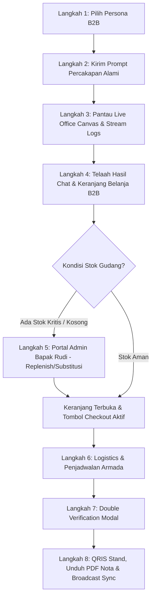

# Panduan Skenario & Prompt Uji Coba Alami QHome-MAS

Dokumen ini menyediakan skenario uji coba *end-to-end* menggunakan daftar **prompt percakapan yang natural** (tidak kaku, tanpa penanda format teknis, dan bebas dari kesan dibuat-buat). Prompt ini dirancang untuk mensimulasikan interaksi nyata antara Pelanggan B2B dan ekosistem Multi-Agent **QHome-MAS (B2B Consultation & Procurement Hub)** seperti yang dijelaskan pada [UserSystemFlow.md](UserSystemFlow.md).

Dengan menyalin dan mengirimkan pesan-pesan alami ini, Anda dapat menguji keselarasan visual *multi-agent*, logika ketersediaan inventaris, perhitungan tarif pengiriman dinamis, otorisasi administratif, hingga sinkronisasi status pembayaran lintas-tab secara real-time.

---

## Peta Alur Uji Coba (Master Workflow)

---

## 1. Skenario Utama: Konsultasi Lengkap & Analisis Tren Pasar
**Fokus Pengujian**: Pemanggilan kelima agen secara bersamaan (**Tile Estimator, Wood Specialist, Paint Consultant, Stone Specialist,** dan **Market Analyst**) dalam satu sesi obrolan terintegrasi.

* **Persona**: Ibu Amalia (Senior Architect & Designer)
* **Lokasi Pengiriman**: Sleman (8 Km dari HQ)

### Prompt Konsultasi (Salin & Tempel)
> "Halo, saya Amalia, arsitek dari Jogja. Saat ini saya sedang mengerjakan proyek renovasi ruang keluarga untuk klien di daerah Sleman. Klien saya menginginkan konsep modern kontemporer yang elegan tapi tetap terkesan hangat dan ramah anak. Untuk area lantai bersih ukuran 6x6 meter, kami berencana menggunakan lantai granit polished motif Carrara putih ukuran 60x60. Lalu untuk backdrop TV seluas 15 meter persegi, tolong rekomendasikan panel kayu fluted warna Walnut agar ruangan terasa lebih nyaman. Di ruangan itu juga ada pilar beton yang ingin kami balut dengan batu alam veneer sekitar 10 meter persegi sebagai aksen tekstur alami. Untuk sisa dinding ruangan lainnya, kami butuh pilihan cat interior premium yang mudah dibersihkan dari coretan anak-anak. Terakhir, tolong berikan analisis singkat mengenai tren material interior yang sedang populer saat ini di Indonesia agar proyek ini tetap terlihat modern dan tidak ketinggalan zaman. Terima kasih."

### Alur Uji Coba & Verifikasi:
1. **Pilih Persona**: Pilih **Ibu Amalia** pada dropdown profil di dashboard.
2. **Kirim Brief**: Salin prompt di atas, tempelkan ke kolom chat, lalu kirim.
3. **Amati Proses Berpikir (Live Office Canvas & Logs)**:
   * Avatar **Chief Supervisor** menyala hijau mengarahkan alur kerja.
   * Avatar **Tile, Wood, Stone, Paint,** dan **Researcher** menyala berurutan saat melakukan tugasnya.
   * Panel terminal log menampilkan *chain-of-thought* analisis MCP tools dan kalkulator sipil secara real-time.
4. **Verifikasi Output**:
   * **Chat (Tengah)**: Menampilkan respons naratif yang luwes dan rekomendasi estetika dari masing-masing spesialis tanpa tabel harga kaku.
   * **B2B Cart (Kanan)**: Terisi otomatis dengan item terkurasi (Granit polished Carrara, Panel Kayu Walnut, Batu Alam Veneer, Cat Interior Premium, Semen Perekat, Nat, UV coating) beserta subtotal harga yang rapi.

---

## 2. Skenario Penyelamatan Stok & Komunikasi ke Admin Portal (OOS Flow)
**Fokus Pengujian**: Menguji jalur "Sinyal Admin" di mana agen *Market Analyst* (Inventory) mendeteksi kekurangan stok di database, melabeli produk dengan tag khusus, yang secara otomatis ditangkap oleh sistem frontend untuk membuka akses ke **AdminPortal.tsx**.

* **Persona**: Bapak Joko (General Contractor & Engineer)
* **Lokasi Pengiriman**: Bantul (15 Km dari HQ)

### Prompt Tahap 1: Memancing Stok Kritis (Salin & Tempel)
> "Siang mas/mbak, saya Joko, kontraktor di Bantul. Kami sedang butuh cepat ubin lantai granit premium dan beberapa panel kayu dekoratif untuk area dinding proyek kami. Klien kami minta motif khusus yang tidak pasaran, seperti granit polished hitam motif obsidian atau panel kayu impor premium. Tolong dicarikan opsi yang ready ya, soalnya proyek kami harus buru-buru selesai minggu depan."

### Alur Uji Coba (Sinyal ke Admin):
1. **Analisis Agen Inventaris (Market Analyst)**:
   * Setelah agen spesialis memilih ubin/kayu, *Market Analyst* akan mengecek database Gudang.
   * Jika stok `< 20` atau `0`, agen akan memberikan sinyal ke frontend dengan menyisipkan tag `[STOK TERBATAS]` atau `[STOK HABIS]` pada nama produk, serta memunculkan alternatif dengan tag `(Substitusi)`.
2. **Respons B2B Cart**:
   * Keranjang B2B akan membaca tag *string* tersebut dan memunculkan *banner* merah peringatan bahwa Checkout dikunci.
   * Muncul tombol **"Intervensi Admin"**.

### Prompt Tahap 2: Memicu Intervensi Admin (Opsional)
> "Aku butuh yang ini, tolong bilang ke admin untuk restock segera ya."
*(Catatan: Langkah ini menguji respons LLM dalam mengakomodasi instruksi administratif, namun Anda tetap bisa langsung masuk ke portal Admin).*

### Alur Uji Coba (Eksekusi Admin):
1. Klik **"Intervensi Admin"** di cart. Layar beralih ke portal Bapak Rudi (**AdminPortal.tsx**).
2. **Panel Permintaan Restok**: Admin melihat item dengan tag `[STOK HABIS]`. Admin dapat memasukkan angka dan klik **Restock**. Sistem akan menembak API POST ke database dan me-*refresh* stok.
3. Klik **Kembali Ke Chat** di sudut kanan atas.

---

## 3. Skenario Stateful RAG & Memori Jangka Panjang (Paska-Restok)
**Fokus Pengujian**: Menguji fitur *Stateful RAG* (via fungsi `_should_reuse_product`). Agen harus mengingat produk persis dari sesi sebelumnya dan mendeteksi bahwa stok kini sudah penuh, tanpa melakukan pencarian acak ke ChromaDB lagi.

* **Status Sesi**: Lanjutan dari obrolan Skenario 2 (sesi chat yang sama).

### Prompt Cek Stok Paska-Admin (Salin & Tempel)
> "Tadi kata admin sudah direstock. Coba tolong dicek lagi apakah stoknya sudah aman dan hitung ulang total biayanya."

### Alur Uji Coba & Verifikasi:
1. **Bypass ChromaDB**: Agen spesialis membaca indikator `restock` / `hitung ulang` dari prompt. Sistem akan **mem-bypass** pencarian vektor ChromaDB dan me-*reuse* spesifikasi produk lama.
2. **Market Analyst Memeriksa Ulang**: Karena stok di database SQLite baru saja ditambah oleh Admin, *Market Analyst* kini melihat stok berlimpah dan membuang tag `[STOK HABIS]`.
3. **Cart Otomatis Terbuka**: B2B Cart menerima *state* produk yang bersih (tanpa peringatan stok), dan tombol Checkout otomatis menyala kembali. Skenario berhasil!

---

## 4. Skenario Pengadaan Grosir & Logistik Jarak Jauh
**Fokus Pengujian**: Logistik dinamis dan perhitungan biaya pengiriman berdasarkan jarak fisik lokasi pengantaran persona B2B ke **QHome HQ**.

* **Persona**: Ibu Santi (Retail & Procurement Partner)
* **Lokasi Pengiriman**: Kulon Progo (Jarak: **35 Km**)

### Prompt Konsultasi (Salin & Tempel)
> "Selamat siang, saya Santi dari divisi pengadaan retail untuk proyek perumahan baru di Kulon Progo. Kami berencana melakukan pemesanan grosir untuk tipe ubin lantai standar berukuran 60x60 sebanyak 80 dus, serta cat dinding interior warna putih netral sebanyak 15 pail untuk pengerjaan tahap pertama. Mohon dibantu estimasi ketersediaan barang dan perhitungan pengiriman kargo ke lokasi proyek kami di Kulon Progo. Terima kasih."

### Alur Uji Coba & Verifikasi:
1. Setelah cart terisi barang, klik **"Lanjutkan ke Pengiriman"** untuk masuk ke **Step 2 (Logistics)** pada panel kanan B2B Cart.
2. Pilih salah satu armada kargo di bawah ini dan pastikan kalkulasi biaya kirim pada tagihan sesuai rumus jarak Kulon Progo (35 Km):

| Pilihan Armada | Formula Logistik (Jarak: 35 Km) | Hasil yang Harus Tertera |
| :--- | :--- | :--- |
| **Colt Diesel Double (CDD)** | Rp 400.000 + (35 Km × Rp 15.000) | **Rp 925.000** |
| **Truk Fuso Box** | Rp 900.000 + (35 Km × Rp 25.000) | **Rp 1.775.000** |
| **Tronton Wingbox** | Rp 1.800.000 + (35 Km × Rp 40.000) | **Rp 3.200.000** |

*Verifikasi bahwa jika Anda berpindah ke persona **Ibu Amalia (Sleman - 8 Km)** atau **Bapak Joko (Bantul - 15 Km)**, biaya pengiriman otomatis menyesuaikan secara real-time.*

---

## 5. Skenario Verifikasi Transaksi & Sinkronisasi Pembayaran Real-Time
**Fokus Pengujian**: Keamanan otorisasi B2B, pembuatan dokumen PDF nota resmi via ReportLab vector drawing, serta sinkronisasi asinkron lintas-tab menggunakan `BroadcastChannel`.

### Alur Uji Coba & Verifikasi:

1. **Double Verification Modal**:
   * Isi tanggal kirim proyek dan tambahkan catatan pengiriman (misal: *"Akses jalan proyek lebar, muat untuk truk Fuso"*).
   * Klik **"Lanjutkan Verifikasi"**.
   * Popup modal premium akan memblokir layar dengan efek blur. Tombol transaksi dalam keadaan nonaktif.
   * **Wajib centang kedua kotak persetujuan**:
     * [ ] *"Saya memverifikasi spesifikasi arsitektural dan volume material..."*
     * [ ] *"Saya menyetujui jadwal pengiriman kargo dan biaya logistik B2B..."*
   * Setelah dicentang, klik tombol **"PROSES TRANSAKSI RESMI B2B"** untuk mengirim transaksi ke database pergudangan (relasi 3NF).

2. **Halaman Sukses & QRIS**:
   * Panel kanan beralih ke **Step 3 (Success)**, menampilkan Invoice ID resmi (`ORD-XXXXXXXX`) dan simulated QRIS Stand berstandar GPN Indonesia.

3. **Unduh PDF Nota Resmi**:
   * Klik tombol **"Unduh PDF Nota Belanja Resmi"**.
   * Pastikan sistem mengunduh dokumen PDF formal yang berisi rincian item belanja, volume, biaya kirim kargo, catatan akses, serta visualisasi vector QRIS di bagian bawah halaman.

4. **Konfirmasi Pembayaran Lintas-Tab (Tanpa Reload)**:
   * Pastikan tab obrolan chat utama di layar kiri/tengah tetap terbuka.
   * Pada panel sukses di kanan, klik tombol **"Konfirmasi Sudah Bayar"**.
   * **Hasil Sinkronisasi**:
     * Frontend memancarkan sinyal `payment_confirmed` lewat **BroadcastChannel (`qhome_payment_channel`)**.
     * Tab obrolan utama mendeteksi sinyal tersebut dan langsung me-refresh seluruh gelembung chat secara asinkron (mengambil data dari `/api/projects/sessions/{session_id}/messages`).
     * Tab obrolan akan langsung memunculkan pesan baru dari **Chief Supervisor** yang menyatakan bahwa pembayaran terverifikasi sukses dan status pengiriman resmi aktif.
     * Panel sukses menutup secara elegan dalam waktu 1.5 detik tanpa memicu pemuatan ulang halaman web secara keseluruhan (*hard reload*).
