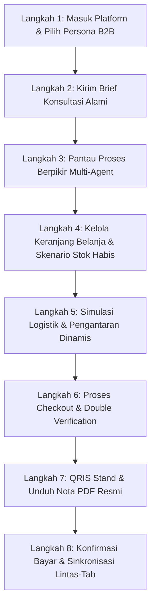

# Tutorial Penggunaan Mandiri QHome-MAS (B2B Consultation & Procurement Hub)

---

### Sistem Navigasi Dokumentasi (QHome-MAS)
* **[Panduan Utama (README)](file:///home/ahmad/projects/qhomemart-mas-agent/README.md)**
* **[Blueprint Arsitektur (ArchitectureConcept)](file:///home/ahmad/projects/qhomemart-mas-agent/docs/ArchitectureConcept.md)**
* **[Roster Karyawan Digital (AgentRoster)](file:///home/ahmad/projects/qhomemart-mas-agent/docs/AgentRoster.md)**
* **[Panduan Struktur Proyek (ProjectStructure)](file:///home/ahmad/projects/qhomemart-mas-agent/docs/ProjectStructure.md)**
* **[Alur Skenario Sistem (UserSystemFlow)](file:///home/ahmad/projects/qhomemart-mas-agent/docs/UserSystemFlow.md)**
* **[Tutorial Penggunaan Mandiri (TutorialUser)](file:///home/ahmad/projects/qhomemart-mas-agent/docs/TutorialUser.md)**

---

Selamat datang di **Tutorial Penggunaan QHome-MAS**! Dokumen ini dirancang khusus untuk memandu Anda merasakan pengalaman langsung menggunakan platform multi-agent secara interaktif. Dengan mengikuti tutorial ini, Anda akan memahami bagaimana sistem multi-agent bekerja sama dengan kalkulator sipil, database real-time, logistik dinamis, hingga sinkronisasi pembayaran real-time lintas-tab.

---

## Peta Alur Perjalanan Pengguna (User Journey Map)

Ikuti langkah-langkah di bawah ini secara berurutan untuk mendapatkan pemahaman mendalam tentang ekosistem QHome-MAS:

---

## Langkah 1: Mempersiapkan Skenario & Memilih Persona B2B

Sebelum memulai obrolan, pilihlah profil persona yang sesuai dengan kebutuhan proyek Anda. Setiap persona memiliki karakteristik proyek dan **jarak fisik pengiriman** yang berbeda dari Kantor Pusat QHome (HQ), yang nantinya akan memengaruhi perhitungan logistik secara otomatis.

> [!TIP]
> Di pojok kiri atas/dashboard aplikasi, cari menu dropdown persona dan pilih salah satu profil di bawah ini:
> * **Ibu Amalia (Senior Architect & Designer)**: Lokasi Sleman (Jarak: **8 Km**) — Fokus proyek modern, elegan, ramah anak.
> * **Bapak Joko (General Contractor & Engineer)**: Lokasi Bantul (Jarak: **15 Km**) — Fokus proyek aula besar dengan kebutuhan volume tinggi.
> * **Ibu Santi (Retail & Procurement Partner)**: Lokasi Kulon Progo (Jarak: **35 Km**) — Fokus grosir/tahap awal perumahan baru.

---

## Langkah 2: Memulai Konsultasi dengan Prompt Alami

Setelah memilih persona, Anda dapat berinteraksi langsung dengan sistem AI menggunakan bahasa percakapan yang natural (seperti bertukar pesan biasa dengan konsultan profesional). 

Salin salah satu prompt percakapan alami berikut ke kolom input chat di aplikasi:

### Opsi A: Skenario Konsultasi Desain & Tren (Cocok untuk Persona **Ibu Amalia**)
> **Salin & Tempel Prompt Ini:**
> "Halo, saya Amalia, arsitek dari Jogja. Saat ini saya sedang mengerjakan proyek renovasi ruang keluarga untuk klien di daerah Sleman. Klien saya menginginkan konsep modern kontemporer yang elegan tapi tetap terkesan hangat dan ramah anak. Untuk area lantai bersih ukuran 6x6 meter, kami berencana menggunakan lantai granit polished motif Carrara putih ukuran 60x60. Lalu untuk backdrop TV seluas 15 meter persegi, tolong rekomendasikan panel kayu fluted warna Walnut agar ruangan terasa lebih nyaman. Di ruangan itu juga ada pilar beton yang ingin kami balut dengan batu alam veneer sekitar 10 meter persegi sebagai aksen tekstur alami. Untuk sisa dinding ruangan lainnya, kami butuh pilihan cat interior premium yang mudah dibersihkan dari coretan anak-anak. Terakhir, tolong berikan analisis singkat mengenai tren material interior yang sedang populer saat ini di Indonesia agar proyek ini tetap terlihat modern dan tidak ketinggalan zaman. Terima kasih."

### Opsi B: Skenario Pengadaan Skala Besar / Grosir (Cocok untuk Persona **Ibu Santi**)
> **Salin & Tempel Prompt Ini:**
> "Selamat siang, saya Santi dari divisi pengadaan retail untuk proyek perumahan baru di Kulon Progo. Kami berencana melakukan pemesanan grosir untuk tipe ubin lantai standar berukuran 60x60 sebanyak 80 dus, serta cat dinding interior warna putih netral sebanyak 15 pail untuk pengerjaan tahap pertama. Mohon dibantu estimasi ketersediaan barang dan perhitungan pengiriman kargo ke lokasi proyek kami di Kulon Progo. Terima kasih."

### Opsi C: Skenario Barang Tidak Tersedia / Riset Internet (Menguji OOS & Research Agent)
> **Salin & Tempel Prompt Ini:**
> "Halo, saya Joko dari Bantul. Saya ingin memesan Semen Instan QHome #1 sebanyak 150 sak. Namun, kami juga membutuhkan Cat Dinding Nippon Paint Spotless sebanyak 8 pail dan Perekat Keramik Khusus SikaCeram-200 sebanyak 12 sak yang tidak terdaftar di daftar utama showroom. Tolong carikan spesifikasinya di internet, berikan estimasi harga pasarnya, dan buatkan rincian anggarannya."

### Alur Uji Coba (Sinyal ke Admin):
1. **Analisis Ketersediaan Inventaris (Inventory Administrator)**:
   * Setelah agen spesialis memilih ubin/kayu, *Inventory Administrator* akan mengecek database Gudang.
   * Jika stok `< 20` atau `0`, agen akan memberikan sinyal ke frontend dengan menyisipkan tag `[STOK TERBATAS]` atau `[STOK HABIS]` pada nama produk, serta memunculkan alternatif dengan tag `(Substitusi)`.
2. **Respons B2B Cart**:
   * Keranjang B2B akan membaca tag *string* tersebut dan memunculkan *banner* merah peringatan bahwa Checkout dikunci.
   * Muncul tombol **"Intervensi Admin"**.
---

## Langkah 3: Memantau Proses Berpikir Multi-Agent (Live Canvas)

Sesaat setelah Anda mengirim pesan, perhatikan bagaimana platform memproses permintaan Anda secara kolaboratif:

1. **Chief Supervisor**: Mengaktifkan alur kerja dan memecah kebutuhan Anda ke agen spesialis.
2. **Agent Specialists**:
   * **Tile Specialist**: Menghitung kebutuhan ubin, semen perekat, dan pengisi nat secara presisi menggunakan kalkulator sipil.
   * **Wood Specialist**: Menganalisis kebutuhan panel kayu walnut dan kelengkapannya.
   * **Stone Specialist**: Menghitung kebutuhan batu alam veneer dan perekat khusus luar/dalam ruangan.
   * **Paint Specialist**: Menyarankan jenis cat ramah anak (mudah dibersihkan) dan menghitung volume pail yang dibutuhkan.
   * **Market Analyst**: Menyusun ringkasan tren pasar terkini untuk memastikan desain Anda tetap relevan.
3. **Live Office Canvas**: Di sisi kiri, indikator visual setiap agen akan menyala bergantian sebagai tanda kolaborasi aktif sedang berlangsung.
4. **Terminal Log**: Di panel bawah/samping, Anda dapat melihat log mentah (*thought processes*) bagaimana agen memanggil tools MCP mereka secara transparan.

---

## Langkah 4: Mengelola Keranjang Belanja B2B & Intervensi Stok

Setelah agen selesai merumuskan rekomendasi, **Keranjang Belanja B2B** (B2B Cart) di panel kanan akan otomatis terisi dengan daftar material yang direkomendasikan beserta kalkulasi volumenya.

### Menguji Fitur Stok Terbatas / Habis (OOS Flow):
Jika Anda menggunakan **Opsi Skenario Bapak Joko** (kebutuhan volume ubin dan kayu yang sangat besar), sistem mungkin mendeteksi bahwa stok gudang saat ini tidak mencukupi.

1. **Tag Peringatan**: Keranjang akan menampilkan tag merah menyala `[STOK HABIS]` atau `[STOK TERBATAS]` pada item tertentu.
2. **Kunci Checkout**: Tombol Checkout akan dikunci (dinonaktifkan) demi keamanan transaksi pengadaan.
3. **Tombol Intervensi Admin**: Di bagian bawah keranjang, tombol **"Intervensi Admin"** akan muncul.

### Cara Melakukan Restock (Intervensi Mandiri):
1. Klik tombol **"Intervensi Admin"** di cart. Layar akan beralih secara mulus ke portal **Bapak Rudi (Admin Portal)**.
2. Temukan produk yang kehabisan stok pada daftar inventaris.
3. Masukkan jumlah restock (misal: tambah `200` unit), lalu klik tombol **Restock**. Database PostgreSQL akan langsung diperbarui.
4. Klik tombol **"Kembali Ke Chat"** di sudut kanan atas untuk kembali ke konsultasi Anda.
5. Kirim prompt lanjutan berikut di kolom chat:
   > "Tadi kata admin sudah direstock. Coba tolong dicek lagi apakah stoknya sudah aman dan hitung ulang total biayanya."
6. **Verifikasi Stateful RAG**: Agen spesialis akan memanfaatkan memori jangka panjang (`_should_reuse_product`), mendeteksi pembaruan stok tanpa mengulang pencarian di ChromaDB, lalu membuka kembali tombol Checkout di Keranjang B2B Anda!

### Skenario Barang Tidak Tersedia / Belum Terdaftar di Katalog (OOS Flow & Riset Internet):
Jika Anda meminta barang yang **tidak tersedia** atau **belum terdaftar** dalam katalog master (misalnya meminta merek cat impor khusus atau produk perekat spesifik yang tidak ada di showroom):

1. **Pemicuan Research Agent**: Sistem multi-agent akan mendeteksi ketidaktersediaan barang di database lokal, lalu memicu **Research Agent** (Agen Riset) secara otomatis.
2. **Riset Internet Real-time**: Agen Riset akan melakukan pencarian web secara asinkron menggunakan *Tavily Search API* untuk menemukan estimasi harga pasar, merek alternatif populer di Indonesia, dan spesifikasi kemasan barang tersebut.
3. **Pemberian Estimasi Sementara**: Di dalam ruang obrolan, item tersebut akan diberikan label `(Estimasi Internet - Menunggu Validasi)` dengan estimasi harga pasar agar perhitungan estimasi anggaran proyek Anda tetap dapat berjalan tanpa hambatan.
4. **Penyimpanan Usulan Stok Baru**: Data hasil riset internet tersebut akan disimpan ke database (`stock_recommendations`) dengan status `pending`. Admin Gudang dapat melihat rekomendasi tersebut di Admin Portal untuk divalidasi dan ditambahkan ke dalam katalog master secara resmi jika disetujui.

---

## Langkah 5: Simulasi Logistik & Pengiriman Cargo Dinamis

Setelah stok aman dan keranjang terbuka, klik **"Lanjutkan ke Pengiriman"** untuk beralih ke **Langkah 2 (Logistics)** di panel kanan.

1. Sistem mendeteksi lokasi persona Anda (Sleman: 8 Km, Bantul: 15 Km, atau Kulon Progo: 35 Km).
2. Pilih salah satu jenis armada kargo yang tersedia.
3. Perhatikan biaya pengiriman otomatis dihitung secara real-time berdasarkan rumus berikut:

| Pilihan Armada | Formula Logistik (Jarak = $X$ Km) | Contoh Biaya (Kulon Progo - 35 Km) |
| :--- | :--- | :--- |
| **Colt Diesel Double (CDD)** | Rp 400.000 + ($X$ Km × Rp 15.000) | **Rp 925.000** |
| **Truk Fuso Box** | Rp 900.000 + ($X$ Km × Rp 25.000) | **Rp 1.775.000** |
| **Tronton Wingbox** | Rp 1.800.000 + ($X$ Km × Rp 40.000) | **Rp 3.200.000** |

---

## Langkah 6: Otorisasi Transaksi (Double Verification Modal)

Untuk keamanan transaksi bernilai tinggi khas B2B, sistem menerapkan perlindungan verifikasi ganda sebelum data ditulis secara permanen ke database relasional (3NF).

1. Tentukan tanggal pengiriman proyek dan tambahkan catatan pengiriman (misal: *"Akses masuk gang cukup lebar untuk Fuso"*).
2. Klik tombol **"Lanjutkan Verifikasi"**.
3. **Double Verification Modal** akan muncul dengan efek latar belakang blur (*glassmorphism*).
4. **Wajib centang** kedua kotak persetujuan:
   - [ ] *"Saya memverifikasi spesifikasi arsitektural dan volume material..."*
   - [ ] *"Saya menyetujui jadwal pengiriman kargo dan biaya logistik B2B..."*
5. Setelah kedua kotak dicentang, tombol **"PROSES TRANSAKSI RESMI B2B"** akan aktif. Klik tombol tersebut untuk memproses order.

---

## Langkah 7: QRIS Stand & Unduh Nota Belanja Resmi (PDF)

Begitu transaksi diproses, panel kanan akan beralih ke **Langkah 3 (Success & Payment)**:

1. **Invoice ID**: Menampilkan ID Order resmi (misal: `ORD-XXXXXXXX`).
2. **Simulated QRIS**: Menampilkan gambar QRIS interaktif berstandar GPN.
3. **Unduh PDF Nota**: Klik tombol **"Unduh PDF Nota Belanja Resmi"**.
   * Sistem akan memanggil engine backend untuk menggenerasi PDF dinamis secara langsung.
   * Periksa file PDF yang diunduh: file tersebut berisi rincian item, rumus volume material, biaya kirim logistik, catatan akses jalan, serta logo dan QRIS transaksi resmi.

---

## Langkah 8: Konfirmasi Pembayaran & Sinkronisasi Lintas-Tab

Skenario tercanggih dari platform ini adalah pengujian sinkronisasi data asinkron lintas-tab tanpa memicu pemuatan ulang halaman web secara keseluruhan (*hard reload*).

1. Pastikan tab obrolan chat utama di layar kiri/tengah tetap terbuka.
2. Di panel sukses sebelah kanan, klik tombol **"Konfirmasi Sudah Bayar"**.
3. **Apa yang terjadi di balik layar?**
   * Frontend memancarkan event `payment_confirmed` melalui API **BroadcastChannel (`qhome_payment_channel`)**.
   * Tab obrolan utama mendeteksi event ini, mengambil data terbaru dari server secara asinkron (`/api/projects/sessions/{session_id}/messages`).
   * Chat utama langsung menampilkan pesan ucapan selamat baru dari **Chief Supervisor** yang mengabarkan bahwa pembayaran Anda telah divalidasi dan pengiriman dijadwalkan secara resmi!
   * Panel sukses di kanan akan menutup secara otomatis dalam waktu 1.5 detik dengan transisi animasi yang sangat halus.

---

> [!NOTE]
> Selamat! Anda telah berhasil menyelesaikan seluruh alur penggunaan B2B Consultation & Procurement di platform QHome-MAS. Jika Anda ingin melakukan uji coba kembali dengan skenario atau volume berbeda, silakan pilih persona baru atau segarkan halaman obrolan.
