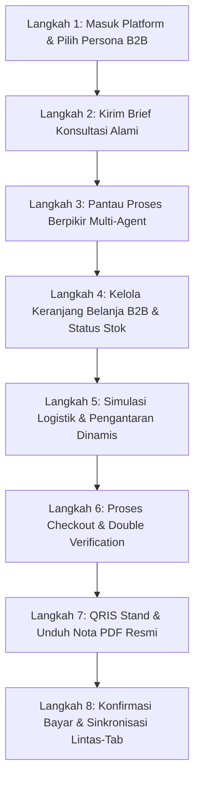

# Tutorial Penggunaan Mandiri QHome-MAS (B2B Consultation & Procurement Hub)

---

### Sistem Navigasi Dokumentasi (QHome-MAS)
* **[Panduan Utama (README)](file:///home/ahmad/projects/qhomemart-mas-agent/README.md)**
* **[Blueprint Arsitektur (ArchitectureConcept)](file:///home/ahmad/projects/qhomemart-mas-agent/docs/ArchitectureConcept.md)**
* **[Roster Karyawan Digital (AgentRoster)](file:///home/ahmad/projects/qhomemart-mas-agent/docs/AgentRoster.md)**
* **[Panduan Struktur Proyek (ProjectStructure)](file:///home/ahmad/projects/qhomemart-mas-agent/docs/ProjectStructure.md)**
* **[Alur Skenario Sistem (UserSystemFlow)](file:///home/ahmad/projects/qhomemart-mas-agent/docs/UserSystemFlow.md)**
* **[Tutorial Penggunaan Mandiri (TutorialUser)](file:///home/ahmad/projects/qhomemart-mas-agent/docs/TutorialUser.md)**

---

Selamat datang di **Tutorial Penggunaan QHome-MAS**! Dokumen ini dirancang khusus untuk memandu Anda merasakan pengalaman menggunakan platform multi-agent secara interaktif. Tutorial ini disusun dari tingkat yang paling sederhana hingga skenario lanjutan: pemesanan langsung tanpa restok, sesi konsultasi murni tanpa belanja, dan skenario pengadaan volume besar yang memicu alur restok oleh admin.

---

## Peta Alur Perjalanan Pengguna (User Journey Map)

---

#### Langkah 1: Memilih Persona Simulasi Melalui Landing Page

Sebelum memulai obrolan, pilihlah profil persona simulasi yang sesuai dengan skenario Anda di landing page:

1.  **Pilih Persona**: Pada bagian **Pilih Persona Simulasi** di landing page, pilih salah satu profil berikut (masing-masing memiliki peran dan konfigurasi logistik yang berbeda):
    *   **Mitra QHomeMart (Mitra B2B / Professional)**: Lokasi Sleman (Jarak: **8 Km**) — Bertindak sebagai pelanggan B2B untuk melakukan simulasi estimasi material proyek (Granit, Cat, Kayu, Batu), waterproofing, saniter toilet, serta pesanan grosir (bulk order).
    *   **Admin Gudang (Lead Warehouse Administrator)**: Lokasi Yogyakarta (HQ) (Jarak: **0 Km**) — Bertindak sebagai administrator gudang yang bertanggung jawab atas manajemen ketersediaan stok kritis, persetujuan restok, dan katalog produk.
2.  **Masuk Workspace**:
    *   Jika memilih **Mitra QHomeMart**, Anda akan otomatis masuk ke halaman **Chat Workspace** untuk berkonsultasi dengan asisten digital dan merencanakan kebutuhan material.
    *   Jika memilih **Admin Gudang**, Anda akan otomatis masuk ke halaman **Admin Portal** untuk mengelola stok gudang secara langsung.

> [!TIP]
> Jika Anda ingin berganti persona atau memulai skenario baru, Anda dapat mengklik tombol **"Keluar"** di pojok kiri atas Chat Workspace untuk kembali ke landing page.

---

## Langkah 2: Memulai Konsultasi dengan Prompt Alami

Setelah memilih persona **Mitra QHomeMart**, Anda dapat berinteraksi langsung dengan sistem AI menggunakan bahasa percakapan yang natural. Anda dapat mengeklik salah satu preset yang tersedia di bagian bawah chat workspace atau menyalin prompt berikut:

### Opsi 1: Skenario Pemesanan Ubin Lantai (Membuat Keranjang - Checkout Jalur Cepat)
> **Salin & Tempel Prompt Ini (atau Klik Preset "Desain Kamar Mandi (Arsitek)"):**
> "Estimasikan kebutuhan ubin granit polished Carrara White 60x60 Roman untuk area kamar mandi seluas 10 m² dengan pola standard. Sertakan juga kebutuhan semen perekat Lemkra FK 206 dan pengisi nat AM 207 untuk pemasangan ubin tersebut."
*   **Mengapa tidak memicu restok?** Ubin utama (FL-001), perekat FK 206 (BM-007), dan pengisi nat AM 207 (BM-008) semuanya **TERSEDIA** di database. Kebutuhan untuk area 10 m² berada di bawah batas stok (50 unit masing-masing), sehingga proses pengadaan dapat langsung dilanjutkan.

### Opsi 2: Skenario Pemesanan Pengecatan Dinding (Membuat Keranjang - Checkout Jalur Cepat)
> **Salin & Tempel Prompt Ini:**
> "Saya ingin merenovasi dinding kamar tidur mungil dengan luas dinding 12 m². Estimasikan kebutuhan cat interior berkualitas untuk pengecatan dan sertakan cat dasar/primer untuk lapisan awal dari katalog QHomeMart."
*   **Mengapa tidak memicu restok?** Sistem akan mencari cat interior terbaik dari katalog berdasarkan area 12 m². Jika cat spesifik tidak tersedia, agent akan menunjukkan alternatif terdekat atau menandai untuk pengadaan.

### Opsi 3: Skenario Pemesanan Lantai SPC Teras (Membuat Keranjang - Jalur Restok / Validasi)
> **Salin & Tempel Prompt Ini:**
> "Saya memerlukan estimasi kebutuhan lantai SPC Flooring Wood untuk area teras seluas 10 m² dengan perkiraan wastage 5%. Sertakan juga coating pelindung UV untuk menjaga warna kayu tetap awet."
*   **Mengapa memicu restok?** Produk lantai utama (SPC Flooring) tersedia di database. Namun, cairan coating pelindung UV merupakan produk luar katalog (`OOS-COATING`) yang diriset harganya dari internet, sehingga memicu peringatan **Pemberitahuan Alokasi Stok / Restok** untuk validasi harga resmi dan mengunci tombol checkout. Pembeli dapat melakukan deseleksi (uncheck) item coating jika ingin langsung checkout (jalur cepat), atau meminta admin gudang menyetujui alokasi stok/harga tersebut lewat Portal Admin.

### Opsi 4: Skenario Konsultasi Tren & Estetika (Murni Konsultasi - Tanpa Keranjang Belanja)
> **Salin & Tempel Prompt Ini (atau Klik Preset "Konsultasi Tren Interior (Desainer)"):**
> "Tolong berikan analisis singkat mengenai tren material interior dan kombinasi palet warna modern kontemporer yang sedang populer di Indonesia saat ini untuk ruang keluarga minimalis."
*   **Mengapa tidak membuat keranjang?** Brief ini hanya berupa pertanyaan informasional tanpa menyebutkan spesifikasi material komersial, ukuran area, atau permintaan kalkulasi unit. AI hanya akan menyajikan narasi analisis tren arsitektural (menggunakan **Market Research Agent**). B2B Cart di sisi kanan akan tetap kosong.

### Opsi 5: Skenario Pengadaan Skala Besar (Memicu Restok Gudang)
> **Salin & Tempel Prompt Ini (atau Klik Preset "Bulk Order Semen (Ritel - Memicu Restok)"):**
> "Kami sedang mengerjakan proyek di Sleman. Cek dan pesan MU-203 Perekat Keramik 50kg dari katalog QHomeMart sebanyak 80 sak. Hitung biaya logistik kargo CDD ke Sleman dan total biayanya."
*   **Mengapa memicu restok?** Permintaan sebanyak 80 sak melebihi batas stok default gudang (50 unit), sehingga secara otomatis memicu status `[STOK TERBATAS]` pada item tersebut dan mengunci tombol checkout. Admin perlu melakukan restock terlebih dahulu.

---

## Langkah 3: Memantau Proses Berpikir Multi-Agent (Live Office Canvas)

Sesaat setelah Anda mengirim pesan, perhatikan bagaimana platform memproses permintaan Anda secara kolaboratif:

1.  **Chief Supervisor**: Menganalisis brief awal Anda dan mengaktifkan agen spesialis terkait (seperti Tile Agent, Paint Agent, atau Market Research Agent).
2.  **Live Office Canvas**: Di **sisi kanan** obrolan (klik tombol ikon **Aktivitas Staf Kantor / User Cog** di pojok kanan atas untuk membuka/menutup panel), indikator visual setiap agen yang aktif menyala hijau bergantian sesuai giliran tugas mereka (*waterfall execution*).
3.  **Proses Berpikir (Thinking Log)**: Di dalam balon chat system atau di panel kanan log aktivitas, Anda dapat mengeklik bagian **"Proses Berpikir Agen"** untuk melihat detail penalaran Chain-of-Thought secara transparan.

---

## Langkah 4: Mengelola Keranjang Belanja B2B & Status Stok

Setelah asisten digital selesai mengurasi material, Anda dapat mengelola daftar belanjaan di halaman keranjang belanja:

1.  **Buka Keranjang**: Klik tombol ikon **Shopping Bag ("Buka Keranjang Pengadaan")** di bagian header pojok kanan atas untuk masuk ke halaman **Order Portal** (`/order`).

### Bagian A: Alur Pembelian Langsung Tanpa Restok (Opsi 1, 2, dan 3)
Agar Anda dapat langsung checkout ke halaman logistik dan pembayaran secara instan:
1.  **Tinjau Keranjang**: Di halaman **Daftar Material**, Anda akan melihat produk utama yang Anda pesan berstatus aktif (bercentang hijau). Namun, jika ada item pendukung otomatis berlabel `(Menunggu Konfirmasi)` dengan harga Rp 0 (seperti pada Opsi 1 & 2) atau cairan coating pelindung UV berlabel `(Estimasi Internet - Menunggu Validasi)` dengan status warning/alokasi (seperti pada Opsi 3), tombol checkout akan terkunci/ditangguhkan sementara.
2.  **Lakukan Deseleksi (Uncheck)**: Hilangkan centang (uncheck) pada item-item bermasalah atau berlabel `(Menunggu Konfirmasi)` / `(Estimasi Internet - Menunggu Validasi)` tersebut dari keranjang.
3.  **Buka Kunci Checkout**: Setelah item-item yang memicu peringatan/restok tersebut dinonaktifkan dari daftar belanja, status proposal di bagian atas berubah menjadi **"Keranjang Belanja Aktif (Telah Disetujui)"** dan tombol **"Lanjut ke Logistik"** akan aktif kembali secara instan!
4.  **Lanjutkan**: Klik tombol tersebut untuk menuju ke halaman konfigurasi kargo.

### Bagian B: Alur Restok Gudang (Opsi 5)
1.  **Kunci Checkout**: Tombol checkout dinonaktifkan (berwarna abu-abu) karena ada item utama berlabel `[STOK HABIS]` / `[STOK TERBATAS]`.
2.  **Portal Admin**: Tombol **"PORTAL ADMIN"** akan muncul di bagian header kanan atas karena adanya peringatan stok kritis.
3.  **Cara Pengisian Stok (Intervensi)**: 
    *   Klik **"PORTAL ADMIN"** untuk membuka halaman **Admin Portal** (menggunakan persona **Admin Gudang**).
    *   Buka **Tab Operasional**, cari produk yang habis, masukkan jumlah restock (misal: tambah `200` unit), lalu klik **Restock**.
    *   Kembali ke tab Chat Workspace, kirim pesan lanjutan: *"Saya sudah restok produk tersebut. Tolong cek kembali ketersediaan stoknya dan hitung ulang total biayanya."*
    *   Sistem memperbarui data, menghilangkan tanda peringatan, dan membuka kembali tombol checkout di Order Portal.

---

## Langkah 5: Simulasi Logistik & Pengiriman Cargo Dinamis

Setelah masuk ke halaman **Logistics** di Order Portal:

1.  Sistem otomatis mendeteksi lokasi pengantaran persona Anda (Sleman: 8 Km untuk Mitra QHomeMart).
2.  Pilih salah satu armada pengiriman kargo yang sesuai (CDD, Fuso, atau Tronton).
3.  Perhatikan biaya pengiriman otomatis dihitung secara real-time berdasarkan rumus berikut:

| Pilihan Armada | Formula Logistik (Jarak = $X$ Km) | Contoh Biaya (Sleman - 8 Km) |
| :--- | :--- | :--- |
| **Colt Diesel Double (CDD)** | Rp 750.000 + ($X$ Km × Rp 15.000) | **Rp 870.000** |
| **Truk Fuso Box** | Rp 1.500.000 + ($X$ Km × Rp 25.000) | **Rp 1.700.000** |
| **Tronton Wingbox** | Rp 3.000.000 + ($X$ Km × Rp 45.000) | **Rp 3.360.000** |

---

## Langkah 6: Otorisasi Transaksi (Double Verification Modal)

Untuk keamanan pengadaan material bernilai tinggi khas B2B, sistem menerapkan perlindungan verifikasi ganda sebelum data ditulis secara permanen ke database.

1.  Tentukan tanggal pengiriman proyek dan tambahkan catatan pengiriman (misal: *"Akses masuk gang cukup lebar"*).
2.  Klik tombol **"Lanjutkan Verifikasi"**.
3.  **Double Verification Modal** akan muncul dengan efek latar belakang blur (*glassmorphism*).
4.  Klik **"Setujui & Kirim Pesanan"** pada modal popup untuk memproses order.

---

## Langkah 7: QRIS Stand & Unduh Nota Belanja Resmi (PDF)

Begitu transaksi diproses, halaman Order Portal akan beralih ke halaman **Success & Payment**:

1.  **Invoice ID**: Menampilkan ID Order resmi (misal: `ORD-XXXXXXXX`).
2.  **Simulated QRIS**: Menampilkan gambar QRIS interaktif berstandar GPN.
3.  **Unduh PDF Nota**: Klik tombol **"Unduh PDF Nota"** atau **"Unduh PDF Nota Belanja Resmi"** untuk mengunduh PDF Nota Pembelian resmi berformat ReportLab vektor yang tajam.

---

## Langkah 8: Konfirmasi Pembayaran & Sinkronisasi Lintas-Tab

1.  Pastikan tab obrolan chat utama di layar kiri/tengah tetap terbuka.
2.  Di halaman sukses pembayaran Order Portal, klik tombol **"Konfirmasi Sudah Bayar"**.
3.  **Sinkronisasi Instan**: Frontend memancarkan event `payment_confirmed` melalui `BroadcastChannel`. Tab obrolan utama langsung menangkap sinyal ini, mengupdate database `payment_status` menjadi `'paid'`, membekukan input obrolan, dan secara otomatis memuat pesan baru dari Chief Supervisor yang mengabarkan pembayaran sukses tanpa memicu pemuatan ulang halaman (*hard reload*).
4.  Halaman Order Portal akan kembali secara otomatis ke halaman Chat Workspace dalam waktu 1.5 detik dengan transisi animasi yang sangat halus.

---

> [!NOTE]
> Selamat! Anda telah berhasil menyelesaikan seluruh alur penggunaan B2B Consultation & Procurement di platform QHome-MAS. Jika Anda ingin melakukan uji coba kembali dengan skenario atau volume berbeda, silakan pilih persona baru atau segarkan halaman obrolan.

